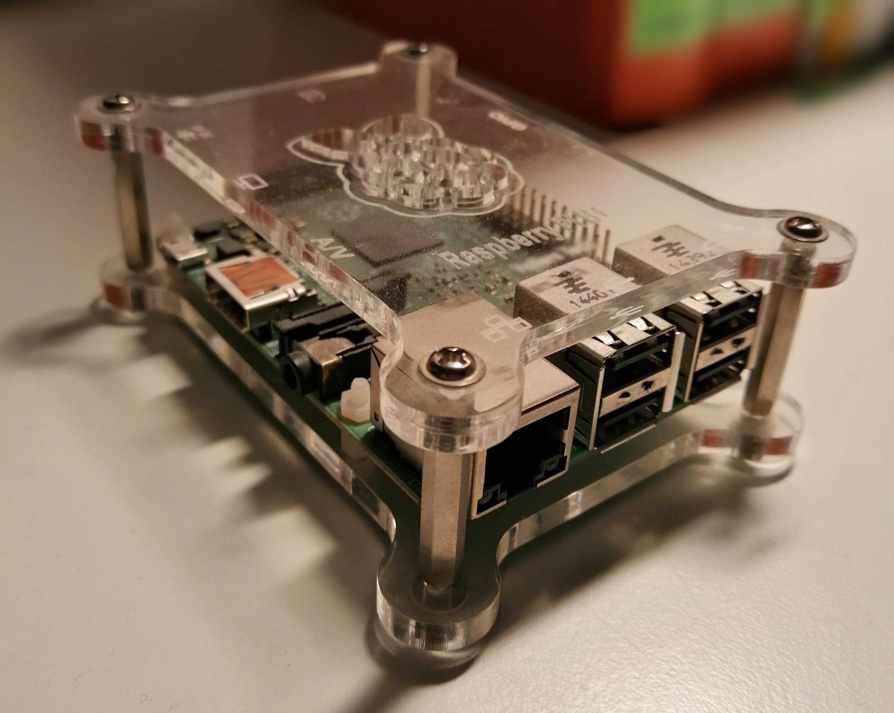

## OpenRC++

A more tutorial-like, DIY-focused and well-documented fork of https://github.com/hamuchiwa/AutoRCCar.

## Dependencies
### Hardware
    - Raspberry Pi version 2 or higher (2B used here)
    - Arduino Uno R3
    - Raspberry pi compatible camera supporting the `picamera` library (Python)
    - HC-SR04 ultrasonic sensor

### Software
    - Python 3 via Conda, `pip`
    - C++, `g++`

Further dependencies are easily installed via Conda/pip requirements text files.

---

## Modules
The project is divided into different modules.

---

### openrcpp-control
Controlling the RC module is done by this software module called _control_.
The simple goal is to access the RC emitter through hardware and let the
car receive commands that where previously sent to the controller in real time.

#### References
    - https://www.arduino.cc/en/tutorial/pushbutton

---

### openrcpp-lanes
The _lanes_ application subset focuses on lane detection for the car.

---

### openrcpp-sonic
The _sonic_ module is used for ultrasonic sensor data evaluation.

---

### openrcpp-streamer
The _streamer_ is used for a fast and stable transmission of
    - captured video frames from the camera
    - sensor data
to the workstation where the post-processing is done.

---

### openrcpp-vision
Computer vision and path prediction are done by the _vision_ application subset.
Image processing methods that go beyond eliminating noise or extracting features
for machine learning can be found in separate modules.

