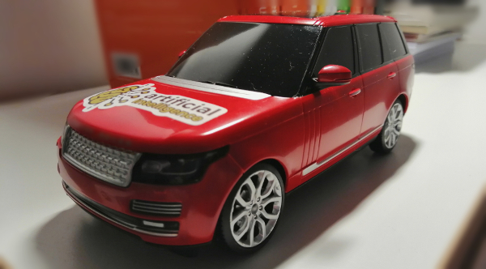
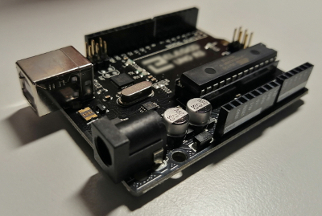

## openrcpp
Open Self-Driving RC Car Project Platform


A more tutorial-like, DIY-focused and well-documented **fork of https://github.com/hamuchiwa/AutoRCCar**.




## Dependencies

### Hardware
- Raspberry Pi version 2 or higher (2B used here)
- Arduino Uno R3
- Raspberry pi compatible camera supporting the `picamera` library (Python)
- HC-SR04 ultrasonic sensors

### Software
- Linux operating system (Ubuntu 18.04.1 used here)
- Arduino IDE and drivers for Arduino Uno R3
- Python 3 via Ana-/MiniConda, `pip`
- C++, `g++`
- `git`

#### Dev environment setup
```
git clone https://github.com/scud3r1a/openrcpp \
&& cd openrcpp \
&& conda create --name openrcpp -y \
&& source activate openrcpp \
&& pip install -r requirements.txt
```
Further dependencies are easily installed via `conda`/`pip` requirements text file.

---

#### Raspberry Pi setup
As an operating system, I choose _HypriotOS_ (https://blog.hypriot.com/downloads/) which is
basically a pure CLI version of Raspbian, specially designed for Docker containers with
cluster integration capabilities and well pre-configured. I prefer to flash images to a Micro SD
card using _Etcher_ (https://www.balena.io/etcher/) but other ways are possible.

After flashing the distro, the following script has to be executed to prepare the Raspberry Pi for its tasks:
```
curl https://raw.githubusercontent.com/scud3r1a/openrcpp/master/init/init-pi.sh | sudo bash
```
When finally set up, the Raspberry Pi runs the _streamer_ module streaming data and video frames.
Also, controlling both the camera and all sensors for data collecting has to be executed
through the Raspberry Pi. Since the ultrasonic sensor does not come with an implemented library like the camera,
we have to use a custom interpretation of the sensor input (towards the system), here defined as the _sonic_ module.

---

#### RC car choices
In this project I used an RC car from _HSP Himoto_, as did the author of the original article.
Basically, most RC cars should work but it is necessary that the voltage supplied through the
Arduino connectors is high enough to actually trigger RC actions as replacement of the original
batteries. The size of the RC car should at least be _1:24_ compared to the original size of the car,
preferably bigger. Furthermore, the shape of the car should make it possible that hardware
is placed on top of it (at least the Raspberry Pi with a case).

The exact wiring of the RC module and the Arduino is described under _Modules - openrcpp-control - Wiring_.

---

## Modules
The project is divided into different modules:

### openrcpp-control
Controlling the RC module is done by this software module called _control_.
The simple goal is to access the RC emitter and let the
car receive commands that where previously sent to the controller in real time -
inspired by concepts like the following:
https://www.instructables.com/id/Python-Arduino-CarControl-v03/.



#### Testing
For keyboard testing, run `keyboard2serial.py`. With the arrow keys, controlling
certain IO pins (digital) on the Arduino board is possible. Therefore, you have
to upload the `serial2rc.ino` routine to the board. In its header, the pins controlled
via the keyboard are defined.

#### Wiring
Inside most remote controls, a circuit is closed for each driving direction when
the corresponding button is pressed. If the output of our electronics is high enough
to be almost equal to the real battery pack, the output voltage delivered to the
RC circuit simulates the closed circuit connecting the batteries to the circuit inside
the remote control. Thus, the usage of batteries is not longer necessary and furthermore,
we can simulate the pressing of these four buttons (for the driving instructions)
by turning on/off the current through our electronics supplied by our Arduino board.

There is either a circuit map available for your exact remote control or you have
to find out the connections by testing and observing the circuits.
In my example, the wiring has to look like the following:


---

### openrcpp-sonic
The _sonic_ module is used for ultrasonic sensor data evaluation.

---

### openrcpp-streamer
The _streamer_ is used for a fast and stable transmission of
- captured video frames from the camera
- sensor data
to the workstation where the post-processing is done. Therefore, the data is

---

### openrcpp-vision
Computer vision and path prediction are done by the _vision_ application subset.
Image processing methods that go beyond eliminating noise or extracting features
for machine learning can be found in separate modules.


---

### References
- https://github.com/hamuchiwa/AutoRCCar
- https://www.instructables.com/id/Python-Arduino-CarControl-v03/
- http://www.youtube.com/watch?feature=player_embedded&v=BBwEF6WBUQs